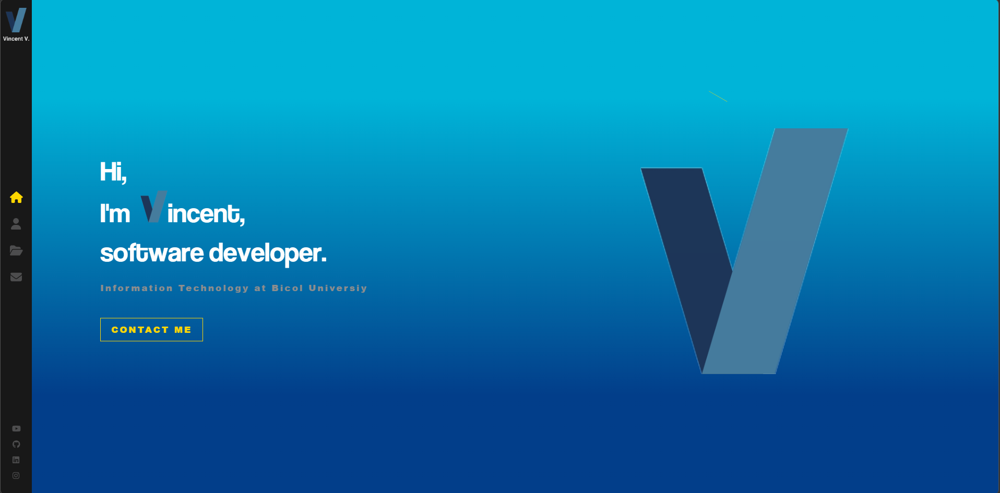

# Vincent Valladolid's Coding Portfolio

Welcome to my portfolio of code! This online application, which showcases my abilities, projects, and accomplishments in the field of web development, was created using ReactJs with Sass styling. 

## Technologies used

ReactJs: A JavaScript library for building user interfaces.
Sass: A CSS preprocessor that enhances the styling capabilities of the application.

## How to install this portfolio

To run this portfolio locally, follow these steps:

1. Clone the repository: git clone https://github.com/Vincent-MV/Website-Portfolio.git

2. Navigate to the project directory: cd PortfolioWebsite

3. Install dependencies: npm install

4. Start the development server: npm start

5. Open your browser and visit http://localhost:3000